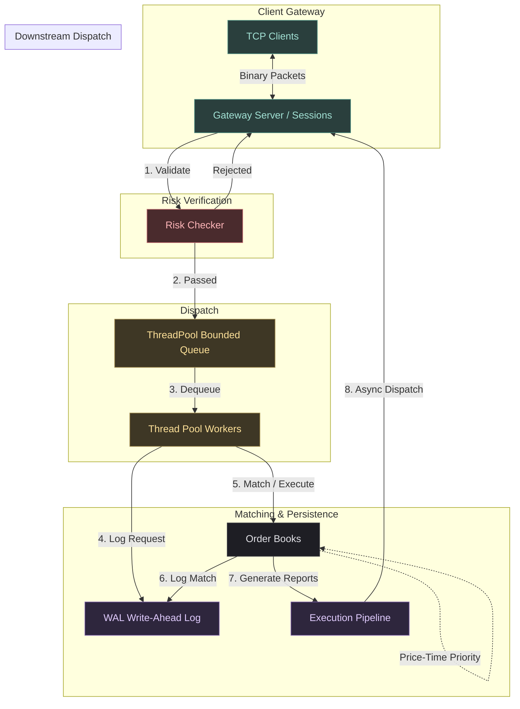
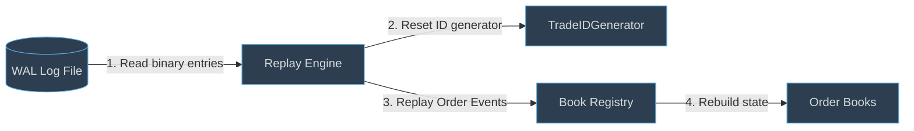

# Stock Exchange Matching Engine (C++20)

A high-performance, low-latency, multi-threaded C++20 stock exchange matching engine. It features asynchronous network ingestion, pre-trade risk checks, concurrent matching across multiple symbol order books, asynchronous write-ahead logging (WAL), state recovery, and an asynchronous execution dispatch pipeline.

---

## Architectural Design

The matching engine is built on an event-driven, pipelined architecture using a thread pool and lock-free queues to pass messages between processing boundaries. Critical sections are isolated, and lock contention is localized to the order books on a per-symbol basis.

### End-to-End System Pipeline



---

## Core Components

### 1. Client Gateway & Serialization
- **`GatewayServer`**: An asynchronous TCP server using header-only `asio` that listens for client connections.
- **`Session`**: Manages individual TCP socket connections, parses incoming byte streams into domain messages, and handles asynchronous writes to clients.
- **`BinarySerializer`**: Implements custom binary serialization for speed and network efficiency. Message structures (`NetOrder`, `NetCancel`, `NetModify`, `NetExecutionReport`) are packed using `#pragma pack(push, 1)` to eliminate compiler padding.
- **`ConnectionManager`**: A thread-safe, centralized registry tracking all active client sessions by ID.

### 2. Pre-Trade Risk Management
- **`RiskChecker`**: A singleton validation boundary. To prevent fat-finger trades or unauthorized activity, it inspects every incoming order prior to submission:
  - Allowed trading symbol verification.
  - Price boundaries checking (`MIN_PRICE` to `MAX_PRICE`).
  - Quantity bounds checking (1 to `MAX_QUANTITY`).
  - Duplicate Order ID identification.
  - Maximum Order Value limit verification (e.g., $5,000,000 maximum order value).
- If validation fails, an `ExecutionReport` with `OrderStatus::Rejected` is immediately dispatched back to the client, avoiding matching engine queue overhead.

### 3. Threading & Concurrency Model
- **`ThreadPool`**: Utilizes a configurable number of worker threads that dequeue and process client tasks.
- **`SafeQueue`**: A bounded blocking queue (`constants::MAX_QUEUE_CAPACITY`) protecting workers from resource starvation or Out-Of-Memory (OOM) failures under heavy traffic bursts.
- **`BookRegistry`**: Manages the instances of active order books in a thread-safe registry, creating them on-demand when symbols are requested.

### 4. Matching Engine Core
- **`OrderBook`**: Uses standard double-sided maps for Bids (sorted descending) and Asks (sorted ascending). It features a dedicated `std::mutex` per order book. Lock contention is confined to the active symbol, allowing different threads to match orders for `AAPL`, `MSFT`, and `GOOG` simultaneously without blocking each other.
- **`OrderIndex`**: A map indexing order IDs to their list iterators inside the book. Enables $O(1)$ lookups for cancellation and modify requests.
- **`MatchingEngine`**: A static utility applying Price-Time Priority (FIFO) matching. Execution price is dictated by the resting order (which has the older timestamp).

### 5. Write-Ahead Logging (WAL) & Replay Recovery
- **`WAL`**: Appends state-changing transactions and execution fills into a binary log file. Ingestion is offloaded to a lock-free Multi-Producer Single-Consumer (`MPSCQueue`) so that worker threads do not stall on disk I/O.
- **`ReplayEngine`**: Reads binary WAL log files sequentially to reconstruct identical `OrderBook` states on startup. It resets the `TradeIDGenerator` to keep recovered trade IDs matching original execution numbers.



### 6. Execution Dispatching
- **`ExecutionPipeline`**: A high-performance dispatch pipeline. Workers publish execution reports and trades into separate lock-free MPSC queues. A dedicated background thread processes them asynchronously to write data to clients through `ConnectionManager`.

---

## Build & Execution Instructions

### Requirements
- A compiler supporting **C++20** (GCC 10+, Clang 10+, or MSVC 2019+).
- Threads and Winsock library support.

### Building & Running the Project
Run the single-command build script from the root directory:

```powershell
.\build.bat
```

This compiles all source files with C++20 and automatically executes `exchange_demo.exe` in your terminal.

